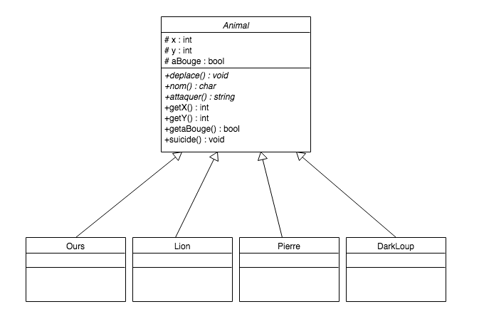

#Rapport du TP Survivor
***Par Willis Pinaud et Eric Lalevée***

##Choix de construction
Dans cette partie nous presenterons des différents choix de construction que nous avons du faire dans le but de réaliser ce jeu.

###La classe Animal
La classe Animal a été structurée suite à un dialogue entre tous les étudiants de l\'option.
Voici le diagramme UML la représentant:

###Les sous-classes animaux

###La classe DarkLoup

##Principe du jeu

###Comment se déroule une partie ?

###Comment affiche-t-on la table de jeu ?

##Jeux de tests

###Initialisation

###Premier tour

...

