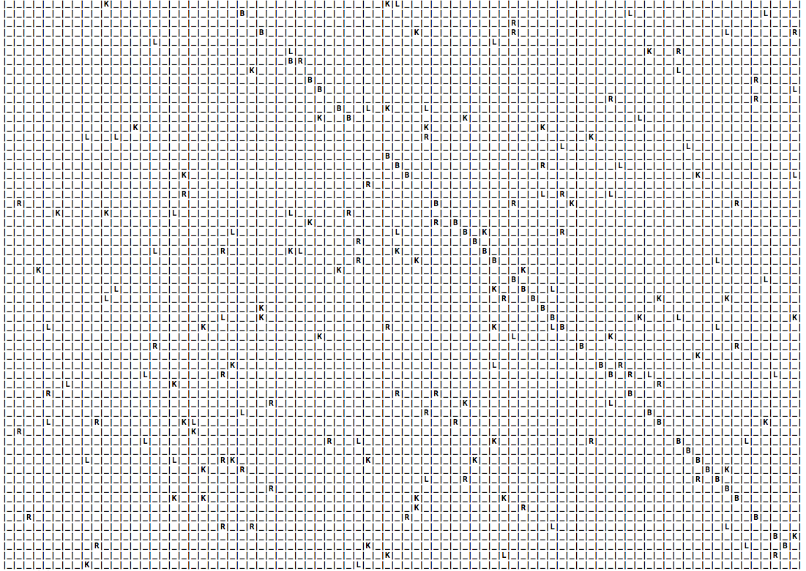
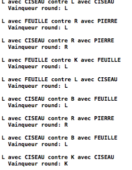

#Rapport du TP Survivor
***Par Willis Pinaud et Eric Lalevée***

##Choix de construction
Dans cette partie nous presenterons des différents choix de construction que nous avons du faire dans le but de réaliser ce jeu.

###La classe Animal
La classe Animal a été structurée suite à un dialogue entre tous les étudiants de l'option.
Voici le diagramme UML la représentant:


###Les sous-classes d'animaux
Chaque classe d'animaux reprend les fonctions virtuelles de la classe mère pour les redéfinir.
Ainsi nos classes deviennent instanciable. 
De plus, les attributs de la classe mère étant private, nous pouvons les réutiliser dans les classes filles par le principe d'héritage.

Nous avons pris en compte les spécificités de chaque espèces, par exemple l'attaque de la classe Pierre est:

```c
std::string Pierre::attaquer(){
return "PIERRE";
}
```

et la fonction ```deplacer()``` de la classe lion:

```c
void Lion::deplace(int i){
    //mouvement d'une case vers le bas
    if (i%2==0){
        y=(y+1)%82;
    }
    //mouvement d'une case sur la droite
    else {
        x=(x+1)%82;
    }
}
```

Lors de la contruction d'un nouvel objet des sous classes d'animaux ses coordonnées x et y sont initialisées à l'aide d'un générateur de nombre aléatoire entre 0 et 82 (la taille du tablea).
Donc à chaque début de partie les animaux sont réparti aléatoirement sur la table de jeu.

Si le match est nul alors on selectionne un vainqueur de maniere aléatoire grâce à l'opérateur ternaire:

```c
vainqueur = ( rand()%2 ? animal1 : animal2 );
```


###La classe DarkLoup
Notre classe Loup personnalisée possède les caractéristiques suivantes:

#### Solution 1
* Bourrin et débile *

1. Fonction d'attaque
Le loup attaque aléatoirement avec une équiprobabilité entre pierre, feuille et ciseaux. 

2. Fonction de déplacement
Dans ce cas, on parcourt l'intégralité de la grille en se déplaçant toujours vers la droite (x++), sauf quand le nombre de tours est un multiple de 82, où l'on se déplace vers le bas (y++). 

3. Autres singularités?
L'espérence de vie de ce loup n'est pas très élevée à priori. 

#### Solution 2
* Le Loup imitant la pierre *

1. Fonction d'attaque
Ce loup ne risquant pas de croiser une pierre, il attaque principalement avec ciseaux (probabilité égale à 60%, contre 20% pour pierre et feuille): 

```c
std::string DarkLoup::attaquer(){
	int i = rand()%10; // génère un nombre aléatoire entre 0 et 9
    std::string attaques[10];
    attaques[0]="CISEAU";
    attaques[1] = "CISEAU";
    attaques[2] = "PIERRE";
    attaques[3] = "PIERRE";
    attaques[4] = "PIERRE";
    attaques[5] = "PIERRE";
    attaques[6] = "PIERRE";
    attaques[7] = "PIERRE";
    attaques[8] = "FEUILLE";
    attaques[9] = "FEUILLE";
	return attaques[i]; 
	}
```

2. Fonction de déplacement
Ce loup imite la pierre: il ne se déplace pas. Cela lui évite de se battre contre des pierres. 

3. Singularité
Ce loup est plus robuste que les autres, car il a de grandes chances de survie contre tous les animaux qu'il peut croiser (il ne peut pas croiser de pierre) à part les autres loups. 
Dans ce cas, quelle que soit la stratégie du loup adverse, c'est lui qui s'est déplacé, il a donc prévu de pouvoir affronter les pierres et a donc moins de chances de victoire sur ce loup. 


#### Solution 3
* Loup imitant un Ours *

1. Fonction d'attaque

De la même manière que le loup imitant la pierre, ce loup imite l'ours, et donc ne peut en affronter qu'au premier tour. Il attaque donc majoritairement avec pierre (60% de proba, comme pour la pierre). 

2. Fonction de déplacement
La fonction de déplacement de ce loup est celle de l'ours. 

3. Singularité

Ce loup risque de mourir vite s'il rencontre des lions, car il joue à quitte ou double contre eux. 

##Principe du jeu

###Comment se déroule une partie ?
Chaque partie se déroule automatiquement car le jeu est un simulateur de vie.
Notre boucle principale comporte une boucle faisant 1000 itérations.

Lors d'un tour de boucle :

0. Chaque animal est créé sur une case aléatoire de la table de jeu.
1. On appel la fonction déplacer de tous les animaux présents sur le plateau de jeu.
2. On vérifie chaque case :

  * si la case est vide on passe à la suivante.
  * si plusieurs animaux sont sur une même case on tire au sort deux animaux, on les fait combattre en appelant leur fonction attaquer, on compare les réponses puis on appel la fonction suicider du perdant.

4. On efface le plateau de jeu du tour précédent.
3. On affiche le plateau de jeu mis à jour.

###Fonction de combat
Notre fonction de combat utilise les propriétés du polymorphisme.
Elle renvoit un pointeur vers un animal et prend en arguments des pointeurs vers des animaux.
Cela nous permet de faire combattre n'importe quelle espèce entre elle.

####Fonctionnement

1. On stock le résultat des fonctions attaquer des deux animaux.
2. On les compare:

  * Feuille/Feuille = nul, donc on choisit un vainqueur aléatoirement.
  * Feuille/Pierre = La feuille gagne.
  * Feuille/Ciseau = Le ciseau gagne.

3. On appel le destructeur du perdant.
4. On renvoit l'animal vainqueur.

###Comment affiche-t-on la table de jeu ?

La fonction d'affichage prend en entrée le vecteur de tous les animaux. 
On commence par créer le plateau 82*82, puis on place les animaux en écrivant leur nom là où sont leurs coordonnées: 
```c
for (int unsigned u=0; u<Animaux.size(); u++){
	plat[Animaux[u]->getX()][Animaux[u]->getY()] = Animaux[u]->nom();}
```
On affiche ensuite chaque case du tableau avec son contenu, en alignant les colonnes avec des tabulations. 

###Limite de notre jeu (bugs et autres joyeusetés)
D'abord, quand on initialise le plateau de jeu, on constate que les ours sont presque tous sur la diagonale du plateau (x=y). 

Ensuite, notre code fonctionne correctement sur le MacBook de Willis, mais fait planter l'ordinateur sous Windows (Le message : "Le programme ne réponds pas" apparaît). 

Enfin, les loups ne survivent pas très longtemps: bien moins que les lions et les ours. 

##Jeux de tests

###La table de jeu


###Les combats


...

